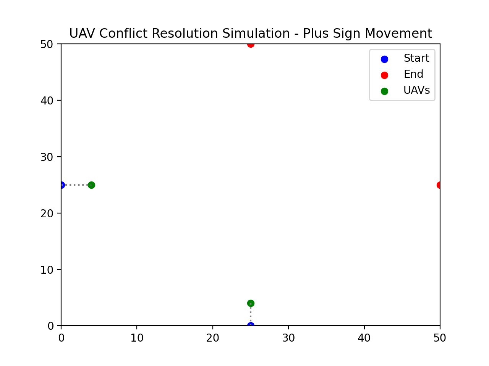

# UAV Conflict Resolution with PX4 and ROS2 Integration

## Overview
This repository implements a UAV conflict resolution algorithm using **PX4, MAVLink, and ROS2**. It simulates UAV motion in a **plus-sign pattern**, where:
- The **first UAV** follows a waypoint-based trajectory in **offboard mode**.
- The **second UAV** (dummy UAV) moves across without velocity variation.
- If a conflict is detected (i.e., the UAVs get too close), the first UAV **reduces speed** dynamically.

The project includes **real-time visualization** of UAV movements using `matplotlib` and integrates with **ROS2 topics** for subscribing to UAV pose and publishing velocity commands.

## Features
- **PX4 Integration**: Communicates with PX4 over MAVLink.
- **ROS2 Integration**: Subscribes to `/dummy_uav/pose` (PoseWithCovarianceStamped) and publishes velocity commands to `/cmd_vel` (Twist).
- **Conflict Detection**: Implements a minimum separation constraint and adjusts speed accordingly.
- **Real-Time Visualization**: Plots UAV trajectories using `matplotlib`.
- **Simulation & Hardware Support**: Works in PX4 SITL and can be extended to real UAVs.

## Simulation Output
Below is an example of the UAV conflict resolution simulation:



## Installation
### Prerequisites
Ensure you have the following installed:
- **PX4 SITL** (for simulation) or real PX4 hardware
- **ROS2** (Foxy, Galactic, or Humble recommended)
- **Python 3.x**
- **Required Python Libraries**:
  ```bash
  pip install numpy matplotlib pymavlink rospy
  ```

### Running the Simulation
1. **Start PX4 SITL**:
   ```bash
   make px4_sitl gazebo
   ```
2. **Run ROS2 Nodes**:
   ```bash
   ros2 launch <your_launch_file>
   ```
3. **Run the Python script**:
   ```bash
   python3 uav_conflict_resolution.py
   ```

## ROS2 Topics
| Topic              | Message Type                  | Description                         |
|-------------------|------------------------------|-------------------------------------|
| `/dummy_uav/pose` | `PoseWithCovarianceStamped`  | Position of the second UAV         |
| `/cmd_vel`        | `Twist`                      | Velocity command for first UAV     |

## Future Enhancements
- Implement **3D conflict resolution**.
- Add **multi-UAV coordination**.
- Extend support for **different UAV models**.

## License
This project is licensed under the **MIT License**.

## Contributors
- **Samiksha R Nagrare | Kumar Ankit**
- Open for contributions! Feel free to submit a PR or raise an issue.

---
**For detailed documentation, check the code files in this repository.**
